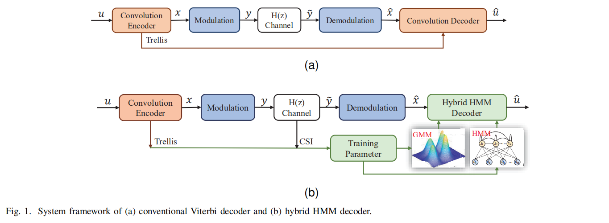

## Overview

This repository is the MATLAB codes related to the following article: "[Hybrid HMM Decoder For Convolutional Codes By Joint Trellis-Like Structure and Channel Prior](https://ieeexplore.ieee.org/document/9943994)"



## Abstract of the Article

The anti-interference capability of wireless links is a physical layer problem for edge computing. Although convolutional codes have inherent error correction potential due to the redundancy introduced in the data, the performance of the convolutional code is drastically degraded due to multipath effects on the channel. In this paper, we propose the use of a Hidden Markov Model (HMM) for the reconstruction of convolutional codes and decoding by the Viterbi algorithm. Furthermore, to implement soft-decision decoding, the observation of HMM is replaced by Gaussian mixture models (GMM). Our method provides superior error correction potential than the standard method because the model parameters contain channel state information (CSI). We evaluated the performance of the method compared to standard Viterbi decoding by numerical simulation. In the multipath channel, the hybrid HMM decoder can achieve a performance gain of 4.7 dB and 2 dB when using hard-decision and soft-decision decoding, respectively. The HMM decoder also achieves significant performance gains for the RSC code, suggesting that the method could be extended to turbo codes.

## About this code

Source code for HMM-Decoder.

- Modulation: BPSK
- Eb/N0: 0-15 dB
- Block length: 1000 bits
- test_block: 1000
- K: 3
- P: 3
- Method: CONV or RSC
- Channel: AWGN or Multipath

### Software platform

Matlab 2021a

### Requirement

The code uses repository from Qiuqiang Kong:

- [matlab-hmm](https://github.com/qiuqiangkong/matlab-hmm)

### Contents of directories

```
.
├── dataset
    ├── AWGN.mat
	├── Multipath.mat
	└── RSC.mat
├── img
├── src
	├── matlab-hmm
	 	├── matlab-gmm
	├── Config.m
	├── HMM_Decoder.m
	└── ...
└── README.md 
```

### Usage

1. Download this repository
2. Download the [dataset](https://drive.google.com/file/d/1hjPtdSbh-aOpDKWf-ddpNFzU-tW2_JD9/view?usp=share_link) and unzip to `./dataset`.
3. Download [matlab-hmm](https://github.com/qiuqiangkong/matlab-hmm) and add to `./src/matlab-hmm`.
4. Run `Config.m` to setup the SIMULATION PARAMETERS.
5. Run `HMM_Decoder.m` in MATLAB.

### Results

If you want to get the figure in the paper, you would setup as follows. 

**Note:** The result of `RNN Decoder` is the implementation of the ICLR2018 paper ['Communication algorithms via deep learning'](https://openreview.net/forum?id=ryazCMbR-). The official codes can be found in [yihanjiang/Sequential-RNN-Decoder](https://github.com/yihanjiang/Sequential-RNN-Decoder)

**Figure 4(a): The BER of the standard Viterbi Decoder, HMM decoder and RNN decoder using hard-decision and soft-decision respectively in AWGN channel.**

```matlab
% Config.m
config.K = 3;      % K: constraint length
config.P = 3;      % P: the number of generator polynomial functions
config.method = 'CONV';         % CONV or RSC
config.train_packnum = 10;
config.test_packnum = 1000;
config.filename = './../dataset/AWGN.mat';
```


**Figure 4(b):  The BER of the standard Viterbi Decoder, HMM decoder and RNN decoder using hard-decision and soft-decision respectively in multiple channel.**

```matlab
% Config.m
config.K = 3;      % K: constraint length
config.P = 3;      % P: the number of generator polynomial functions
config.method = 'CONV';         % CONV or RSC
config.train_packnum = 10;
config.test_packnum = 1000;
config.filename = './../dataset/Multipath.mat';
```


**Figure 8:  The validity of the hybrid HMM decoder on the RSC code.**

```matlab
% Config.m
config.K = 3;      % K: constraint length
config.P = 3;      % P: the number of generator polynomial functions
config.method = 'RSC';         % CONV or RSC
config.train_packnum = 10;
config.test_packnum = 1000;
config.filename = './../dataset/RSC.mat';
```


## Citing

If you use this repository in your research, please cite this paper.

```
@ARTICLE{9943994,  
    author={Li, Haoyu and Wang, Xuan and Liu, Tong and Fang, Dingyi and Liu, Baoying},  
    journal={IEEE Transactions on Cognitive Communications and Networking},   
    title={Hybrid HMM Decoder For Convolutional Codes By Joint Trellis-Like Structure and Channel Prior},   
    year={2022},  
    volume={},  
    number={},  
    pages={1-1},  
    doi={10.1109/TCCN.2022.3220766}
}
```

If you are for commercial use, please contact the author.

AUTHOR: Haoyu Li
CONTACT: lihaoyu@stumail.nwu.edu.cn

## Acknowledgment

